# Course Dependency Graph

```mermaid
%%{init: {'theme': 'base', 'themeVariables': { 'fontSize': '14px' }}}%%
flowchart TD

    %% ── Module 1: Financial Foundations ──────────────────────────
    subgraph M1["MODULE 1 — Financial Foundations"]
        W1["W1: Markets & Data\n🔴 ✅ 📓"]
        W2["W2: Time Series & Stationarity\n🔴 ✅ 📓"]
        W3["W3: Portfolio Theory & Risk\n🔴 ✅ 📓"]
    end

    %% ── Module 2: Classical ML ──────────────────────────────────
    subgraph M2["MODULE 2 — Classical ML"]
        W4["W4: Linear Models\n🔴 ✅ 📓"]
        W5["W5: Trees / XGBoost\n🔴 ✅ 📓"]
        W6["W6: Financial ML Methodology\n🔴 ✅ 📓"]
    end

    %% ── Module 3: Deep Learning ─────────────────────────────────
    subgraph M3["MODULE 3 — Deep Learning"]
        W7["W7: Feedforward Nets\n🟡 ✅ 📓"]
        W8["W8: LSTM / GRU\n🟡 ✅ 📓"]
        W9["W9: Foundation Models\n🔴 ✅/⚡ 📓"]
        W10["W10: NLP / Embeddings\n🔴 ✅/⚡ 📓"]
    end

    %% ── Module 4: Advanced Topics ───────────────────────────────
    subgraph M4["MODULE 4 — Advanced Topics"]
        W11["W11: Bayesian DL & Uncertainty\n🟡 ✅ 📓"]
        W12["W12: Graph Neural Networks\n🟡 ✅ 📓"]
        W13["W13: RL for Portfolios\n🟡 ⚡ 📓"]
        W14["W14: Neural Options\n🟡 ✅ 📓"]
        W15["W15: HFT & Microstructure\n🟡 ✅ 📖"]
        W16["W16: Market Making\n🟡 ✅ 📓"]
    end

    %% ── Module 5: Alt Markets & Capstone ────────────────────────
    subgraph M5["MODULE 5 — Alt Markets & Capstone"]
        W17["W17: Crypto & DeFi ML\n🟢 ✅ 📓"]
        W18["W18: Backtesting & Capstone\n🔴 ✅ 📓"]
    end

    %% ══════════════════════════════════════════════════════════════
    %% CORE SPINE (sequential prerequisites)
    %% ══════════════════════════════════════════════════════════════
    W1 -->|"data pipeline\nreturns math"| W2
    W2 -->|"stationarity\nGARCH baseline"| W3
    W3 -->|"risk metrics\nfactor models"| W4
    W4 -->|"feature matrix\nexpanding-window CV"| W5
    W5 -->|"best model to\napply methodology to"| W6

    %% ══════════════════════════════════════════════════════════════
    %% MODULE 3 BRANCHES (from classical ML into deep learning)
    %% ══════════════════════════════════════════════════════════════
    W5 -->|"cross-sectional\nfeature matrix"| W7
    W7 -->|"PyTorch, training loops\ndropout, BN"| W8
    W7 -->|"transformer basics\nfor TFT"| W9
    W5 -->|"XGBoost for\nhybrid approach"| W9
    W7 -->|"PyTorch for\nFinBERT/embeddings"| W10
    W5 -->|"XGBoost for\ntext+price comparison"| W10

    %% ══════════════════════════════════════════════════════════════
    %% MODULE 4 BRANCHES (advanced topics fan out from DL core)
    %% ══════════════════════════════════════════════════════════════

    %% Bayesian DL
    W7 -->|"dropout & ensemble\nmethods as foundation"| W11

    %% GNNs
    W7 -->|"PyTorch / autograd"| W12
    W4 -->|"cross-sectional\nranking framework"| W12
    W5 -->|"XGBoost baseline\nfor comparison"| W12

    %% RL
    W3 -->|"portfolio theory\nSharpe objective"| W13
    W7 -->|"neural nets for\npolicy/value networks"| W13

    %% Neural Options
    W7 -->|"PyTorch autograd\nfor Greeks"| W14

    %% HFT
    W1 -->|"order books\nmicrostructure basics"| W15

    %% Market Making
    W13 -->|"RL algorithms\n(PPO, SAC)"| W16
    W15 -->|"LOB intuition\nmicrostructure context"| W16

    %% ══════════════════════════════════════════════════════════════
    %% MODULE 5 CONNECTIONS
    %% ══════════════════════════════════════════════════════════════

    %% Crypto
    W5 -->|"XGBoost for\ncrypto prediction"| W17
    W8 -->|"LSTM for\ncrypto sequences"| W17

    %% Capstone (integrates everything)
    W6 -->|"triple-barrier\npurged CV"| W18
    W3 -->|"risk metrics\n(basic → advanced)"| W18
    W5 -->|"best ML model"| W18
    W15 -->|"realistic\ntxn cost understanding"| W18

    %% ══════════════════════════════════════════════════════════════
    %% CROSS-MODULE SOFT REFERENCES (concepts reused, not hard prereqs)
    %% ══════════════════════════════════════════════════════════════
    W2 -.->|"GARCH as\nbaseline"| W8
    W4 -.->|"expanding-window CV\n(taught here, used everywhere)"| W18
    W6 -.->|"DSR preview →\nfull treatment"| W18

    %% ══════════════════════════════════════════════════════════════
    %% STYLING
    %% ══════════════════════════════════════════════════════════════
    style M1 fill:#fce4ec,stroke:#c62828,stroke-width:2px
    style M2 fill:#e8f5e9,stroke:#2e7d32,stroke-width:2px
    style M3 fill:#e3f2fd,stroke:#1565c0,stroke-width:2px
    style M4 fill:#fff3e0,stroke:#e65100,stroke-width:2px
    style M5 fill:#f3e5f5,stroke:#6a1b9a,stroke-width:2px

    style W1 fill:#ffcdd2
    style W2 fill:#ffcdd2
    style W3 fill:#ffcdd2
    style W4 fill:#c8e6c9
    style W5 fill:#c8e6c9
    style W6 fill:#c8e6c9
    style W7 fill:#bbdefb
    style W8 fill:#bbdefb
    style W9 fill:#bbdefb
    style W10 fill:#bbdefb
    style W11 fill:#ffe0b2
    style W12 fill:#ffe0b2
    style W13 fill:#ffe0b2
    style W14 fill:#ffe0b2
    style W15 fill:#ffe0b2
    style W16 fill:#ffe0b2
    style W17 fill:#e1bee7
    style W18 fill:#e1bee7
```

## Dependency Audit

### Hard Prerequisites (student MUST have completed the prior week)

| Week | Hard Prerequisites | What's Needed |
|------|-------------------|---------------|
| W2 | W1 | Data pipeline, returns math |
| W3 | W2 | Stationarity concepts, GARCH |
| W4 | W3 | Factor models, risk metrics |
| W5 | W4 | Feature matrix, expanding-window CV |
| W6 | W5 | ML model to apply methodology to |
| W7 | W5 | Cross-sectional features |
| W8 | W7 | PyTorch, training loops |
| W9 | W7, W5 | Transformers + XGBoost for hybrid |
| W10 | W7, W5 | PyTorch + XGBoost for comparison |
| W11 | W7 | Dropout and ensemble concepts |
| W12 | W7, W4, W5 | PyTorch + cross-sectional ranking + XGBoost baseline |
| W13 | W3, W7 | Portfolio theory + neural nets |
| W14 | W7 | PyTorch autograd |
| W15 | W1 | Microstructure basics |
| W16 | W13, W15 | RL + microstructure context |
| W17 | W5, W8 | XGBoost + LSTM |
| W18 | W3, W5, W6 | Risk metrics + ML model + methodology |

### Soft References (concepts reused but not strictly required)

| From | To | What's Referenced |
|------|-----|------------------|
| W2 | W8 | GARCH as baseline competitor for LSTM |
| W4 | W18 | Expanding-window CV (taught in W4, used in capstone) |
| W6 | W18 | DSR preview in W6 → full treatment in W18 |
| W15 | W18 | Transaction cost understanding informs realistic backtesting |

### Potential Issues Checked

| Check | Status | Notes |
|-------|--------|-------|
| Circular dependencies | ✅ None | All edges flow forward (lower → higher week number) |
| Missing prereqs | ✅ None | Every concept used in a week is taught in a prior week |
| Orphan weeks | ✅ None | Every week connects to the graph |
| Temporal ordering | ✅ OK | W15 (HFT) before W16 (MM); W13 (RL) before W16 (MM) |
| DSR duplication | ✅ Fixed | W6 = preview only, W18 = full treatment |
| Metrics duplication | ✅ Fixed | W3 = basic metrics, W18 = advanced evaluation metrics |
| Expanding-window CV | ✅ Fixed | W4 = formal introduction, used in W5+ |
| W11 (Bayesian) placement | ✅ OK | After W7 (needs dropout/ensembles), before GNNs |
| W17 (Crypto) standalone-ish | ✅ OK | Only needs W5 (XGBoost) + W8 (LSTM), no other advanced prereqs |
